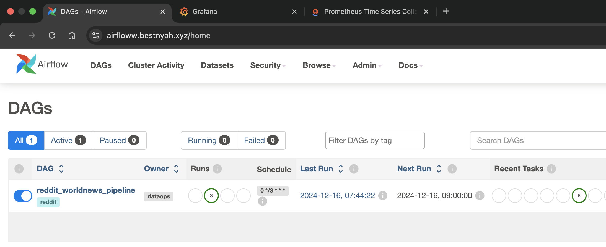
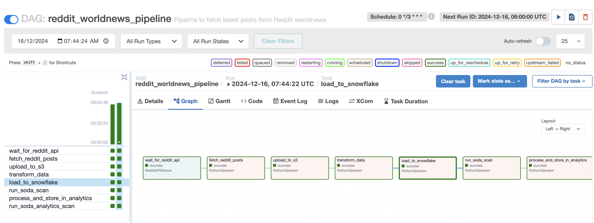
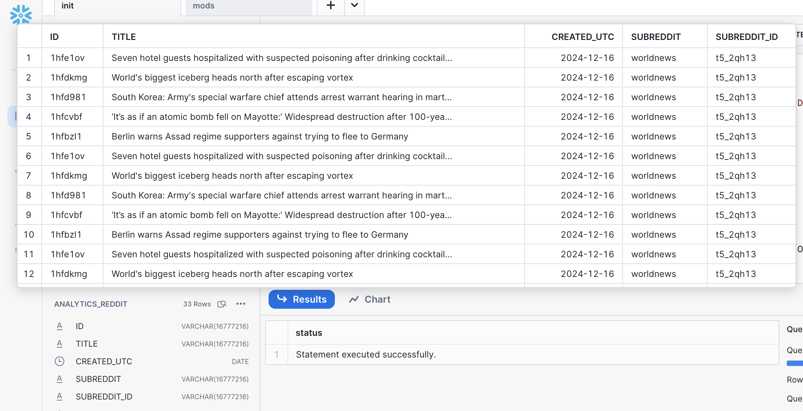
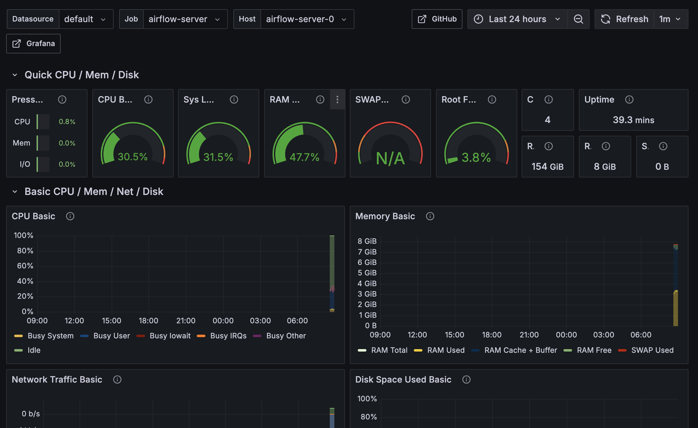
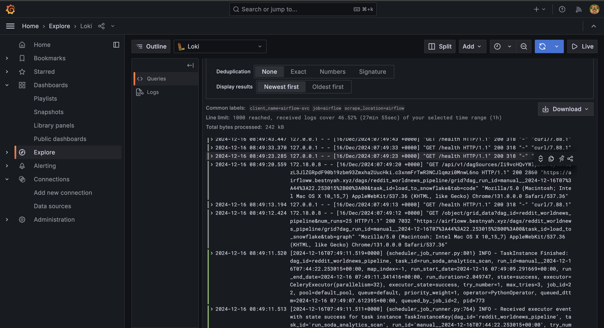
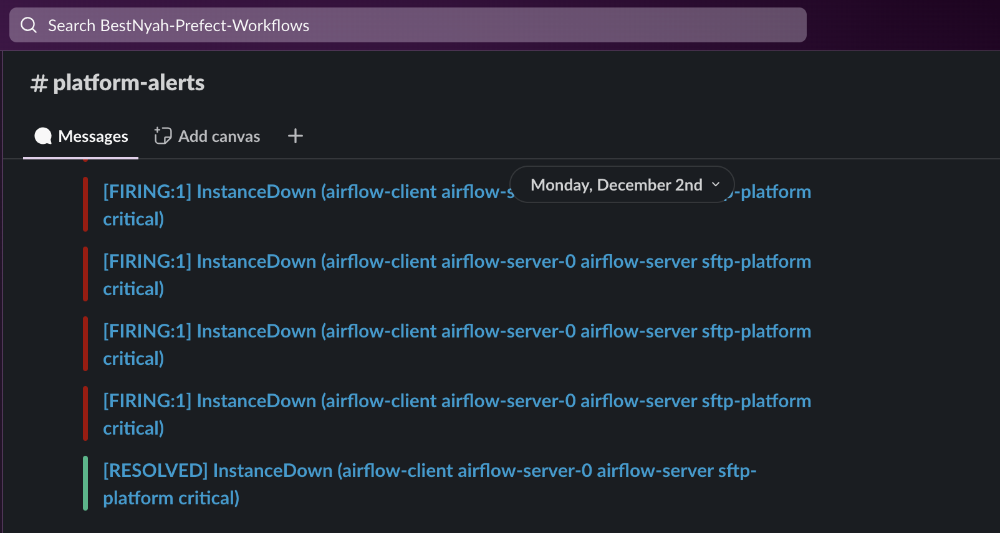

# Reddit-r-worldnews-pipeline

This repository contains the code for a production-ready and secure Airflow instance powering the Reddit Worldnews Subreddit pipeline and its associated infrastructure, hosted on DigitalOcean Cloud. The infrastructure ensures robust storage, high availability, and enhanced security. The pipeline is designed to extract Worldnews data for analytical purposes, with comprehensive monitoring and observability integrated to track performance, health, and reliability.


## Infrastructure Overview

The key components include:

- Digital Ocean Cloud: DigitalOcean's cloud resources serve as the foundation for the pipeline infrastructure, including components such as Droplets (servers), Spaces (S3-compatible data lake storage), Reserved IPs, and Domain Record Routing.

- Terraform: This Infrastructure as Code (IAC) tool was used to provision cloud resources on DigitalOcean and Snowflake Data Warehouse, ensuring efficient management of resources in a scalable and production-ready manner.

- Ansible: Ansible was utilized to automate the installation of services, tools, and frameworks, enabling the implementation of a CI model for efficient project management.

- Docker & Docker Compose: This was used to containerize the application's services, ensuring consistency across development.

- Snowflake (Data Warehouse): Snowflake was implemented as the data warehouse solution, providing scalable, high-performance storage and analytics capabilities for the project's data processing needs.

- Monitoring Setup (Prometheus, Loki & Grafana): Prometheus, Loki, and Grafana were integrated to establish a comprehensive monitoring and logging solution.

- Soda Core (Data Quality): Soda Core was utilized to ensure data quality across the pipeline.


## Continous Integration
CI is managed through GitHub Actions, which automates and streamlines various processes within the infrastructure. Triggered by pushes to the main branch, it includes the following tasks:

- Updating DAGs: Automatically updates DAG code in the DAG folder whenever changes are made in the code repository.
- Ansible Linting: Enforces best practices and standards for Ansible playbook configurations to maintain consistency and quality.
- Services Updates: configures updates on services running on the Droplets, including the monitoring setup.

## Infrastructure Setup
 >  🚨 Note! :
    > The entire automation process can be fully automated using GitHub Actions. By including the necessary commands from the [`Makefile`](ansible/Makefile), the playbooks can be executed automatically whenever a change is pushed to the repository. However, for the initial setup, I preferred running the commands locally to ensure a smooth and controlled environment setup.

#### Requirements
- Digital Ocean Cloud account
- Snowflake cloud account
- Domain name ([namecheap](https://www.namecheap.com/) domain was used here)
- Terraform & Terraform cloud account 
- Ansible
- Slack account


#### Usage
- Configure Terraform with your DigitalOcean API key and Snowflake credentials in the Terraform [variables file](terraform/variables.tf)
- Update the instances reserved IP's in the ansible [hosts.ini](ansible/hosts.ini) file
- Use the Make configurations provided [here](ansible/Makefile) to deploy and start the services. 
    - `Make order` command shows the order of runnng the playbooks
    - Run make help to view instructions for starting specific services. <br>

    The playbooks will initialize the servers by bootstrapping and installing the necessary packages, setting up the Airflow service, and deploying monitoring services. Additionally, they configure Traefik as a reverse proxy to route requests securely to various endpoints, with unique domain records pointing to the respective services. SSL certificates from [Let's Encrypt](https://letsencrypt.org/) are also provisioned to ensure secure connections. 

    *change the traefik configs [here]() to use your own domain* 

    Access the airflow instance with the `A record` assigned to it, and login using the credentials setup in the [variables section for airflow](ansible/group_vars/all/vars.yml) 

    

    The airflow setup requires some variables needs to be added in variables tab on admin menu on the UI

    ```bash
        REDDIT_CLIENT_ID=
        REDDIT_CLIENT_SECRET=
        REDDIT_USERNAME=
        REDDIT_PASSWORD=
        S3_BUCKET=
        SPACES_S3_KEY= 
        SPACES_S3_SECRET=
        SNOWFLAKE_USER= 
        SNOWFLAKE_PASSWORD=
        SNOWFLAKE_ACCOUNT=
        SNOWFLAKE_WAREHOUSE=
        SNOWFLAKE_DATABASE=
        SNOWFLAKE_STG_SCHEMA=
        SNOWFLAKE_STG_TABLENAME=
        SNOWFLAKE_ANALYTICS_SCHEMA=
        SNOWFLAKE_ANALYTICS_TABLENAME=
    ```

    The DAG is configured to execute automatically every 3 hours, ensuring that news data is fetched on a regular 3-hour schedule. In addition to the automated runs, the DAG also supports manual triggers, allowing users to initiate the data-pulling process at any time as needed.

    

    The DAG retrieves data from the Reddit API and stores it in an S3-compatible data lake. It then processes and transforms the data before loading it into Snowflake tables for analytical purposes. Additionally, it performs data quality checks at various stages using Soda Core to ensure accuracy and reliability. 

    


## Monitoring and Observability

The setup is designed to monitor and track the performance metrics and logs of the Airflow instance, ensuring seamless operations and quick issue detection. A Grafana dashboard has been implemented to provide a comprehensive visual representation of real-time metrics, enabling effective monitoring of the instance’s health and performance. This setup helps maintain observability, making it easier to identify and resolve potential bottlenecks or errors.



effective monitoring of the resource usage of the Airflow instance, providing insights into how system resources are utilized based on the workload generated by the ETL processes. It also includes comprehensive logging of all activities performed by the instance, offering a detailed audit trail to track individual processes. These logs are invaluable for identifying issues, troubleshooting errors, and debugging failures, ensuring smooth and reliable execution of workflows.



Alerts are configured to trigger based on predefined rules derived from system metrics. These alerts are sent via a Slack webhook to designated Slack channels, ensuring timely notifications for prompt action and issue resolution.



## Analytics Dashboard

The analytics dashboard provides a clear and interactive view of the Reddit world news data. It offers real-time insights, customizable filters, and key metrics to help users analyze trends effectively. This tool empowers data-driven decisions by leveraging the processed data for actionable insights.


## Author
Best Nyah - [GitHub](https://github.com/Bee0933)

## Hire me
Are you looking for an Engineer to build your next Data Pipeline? Get in touch: bestnyah7@gmail.com

## License
The MIT [License](http://www.opensource.org/licenses/mit-license.php)
