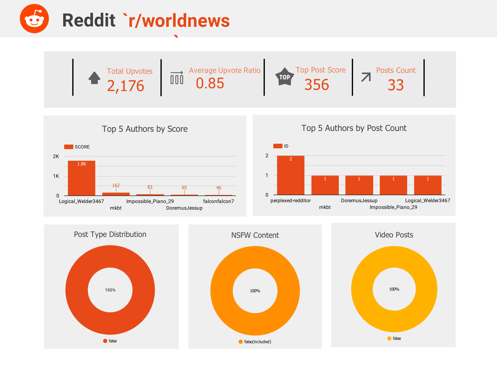

# Reddit-r-worldnews-pipeline

This repository contains the code for the Reddit Worldnews Subreddit pipeline and its associated infrastructure, hosted on DigitalOcean Cloud. It ensures robust storage, high availability, and enhanced security. The pipeline is designed to extract Worldnews data for analytical purposes.

## Infrastructure Overview

The key components include:

- Digital Ocean Cloud: DigitalOcean's cloud resources serve as the foundation for the pipeline infrastructure, including components such as Droplets (servers), Spaces (S3-compatible data lake storage), Reserved IPs, and Domain Record Routing.

- Terraform: This Infrastructure as Code (IAC) tool was used to provision cloud resources on DigitalOcean and Snowflake Data Warehouse, ensuring efficient management of resources in a scalable and production-ready manner.

- Ansible: Ansible was utilized to automate the installation of services, tools, and frameworks, enabling the implementation of a CI model for efficient project management.

- Docker & Docker Compose: This was used to containerize the application's services, ensuring consistency across development.

- Snowflake (Data Warehouse): Snowflake was implemented as the data warehouse solution, providing scalable, high-performance storage and analytics capabilities for the project's data processing needs.

- Monitoring Setup (Prometheus, Loki & Grafana): Prometheus, Loki, and Grafana were integrated to establish a comprehensive monitoring and logging solution.

- Soda Core (Data Quality): Soda Core was utilized to ensure data quality across the pipeline.

## Continous Integration
CI is managed through GitHub Actions, which automates and streamlines various processes within the infrastructure. Triggered by pushes to the main branch, it includes the following tasks:

- Updating DAGs: Automatically updates DAG code in the DAG folder whenever changes are made in the code repository.
- Ansible Linting: Enforces best practices and standards for Ansible playbook configurations to maintain consistency and quality.
- Services Updates: configures updates on services running on the Droplets, including the monitoring setup.

## Infrastructure Setup
Manual Setup

<!--  -->